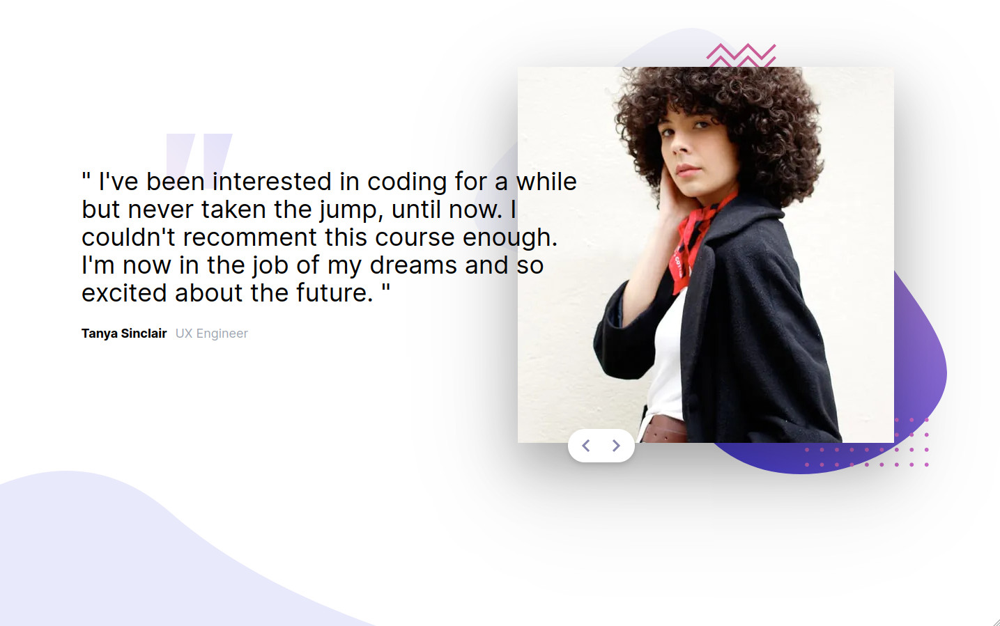

# Frontend Mentor - Coding bootcamp testimonials slider solution

This is a solution to the [Coding bootcamp testimonials slider challenge on Frontend Mentor](https://www.frontendmentor.io/challenges/coding-bootcamp-testimonials-slider-4FNyLA8JL). Frontend Mentor challenges help you improve your coding skills by building realistic projects.

## Table of contents

- [Overview](#overview)
  - [The challenge](#the-challenge)
  - [Screenshot](#screenshot)
  - [Links](#links)
- [My process](#my-process)
  - [Built with](#built-with)
  - [What I learned](#what-i-learned)
  - [Continued development](#continued-development)
  - [Useful resources](#useful-resources)
- [Author](#author)
- [Acknowledgments](#acknowledgments)

## Overview

### The challenge

Users should be able to:

- View the optimal layout for the component depending on their device's screen size
- Navigate the slider using either their mouse/trackpad or keyboard

### Screenshot



### Links

- Solution URL: [Add solution URL here](https://github.com/ttsoares/coding-bootcamp)
- Live Site URL: [Add live site URL here](https://coding-bootcamp-three.vercel.app/)

## My process

### Built with

- Flexbox
- TailwindCSS
- [React](https://reactjs.org/) - JS library
- [Next.js](https://nextjs.org/) - React framework
- [tailwindCSS](https://tailwindcss.com/) - For styles

### What I learned

Good practice of controlling the CSS with Tailwind to achieve the responsive requisites.

An opportunity to use the layout feature os NextJS.

```jsx
<html lang="en" className="h-screen w-screen">
  <body className={`${inter.className} relative w-full h-full`}>
    <div className="flex flex-col md:flex-row w-full h-full mt-10 md:mt-0 ml-2 md:ml-0">
      <div className="flex flex-col justify-between  h-full w-full md:w-1/2  order-last md:order-first">
        <div className="w-full flex justify-center md:justify-normal md:w-1/3 md:ml-[240px] mt-8 md:mt-48 ">
          <div className="w-16 h-16 md:w-[95px] md:h-[95px] ">
            <Image src={Quotes} alt="" width={120} height={120} />
          </div>
        </div>
        <div className=" md:w-[80%] h-28 md:h-56 relative items-end">
          <Image src={Curve} fill alt="" />
        </div>
      </div>

      <div className="w-[95%] md:w-[50%] md:mr-20 order-first md:order-none">
        <Image src={PatternBg} alt="" className="md:mt-10" />
      </div>
    </div>
    {children}
  </body>
</html>
```

### Continued development

I'm still not comfortable with the 'mobile first' approach. Yet it is easier to set the desktop and then move down to mobile.

### Useful resources

- [TailwindCSS](https://tailwindcss.com/docs/) - Tailwind CSS works by generating the corresponding styles and then writing them to a static CSS file.
- [Box Shadows](https://manuarora.in/boxshadows) - A curated list of box shadows for TailwindCSS. Available in JIT 🚀 and vanilla CSS.

## Author

- Website - [Thomas Tschoepke Soares](https://www.linkedin.com/in/thomas-soares-6791781b/)
- Frontend Mentor - [@ttsoares](https://www.frontendmentor.io/profile/ttsoares)

## Acknowledgments

Several very useful Youtube videos from nice persons helping the IT community...
